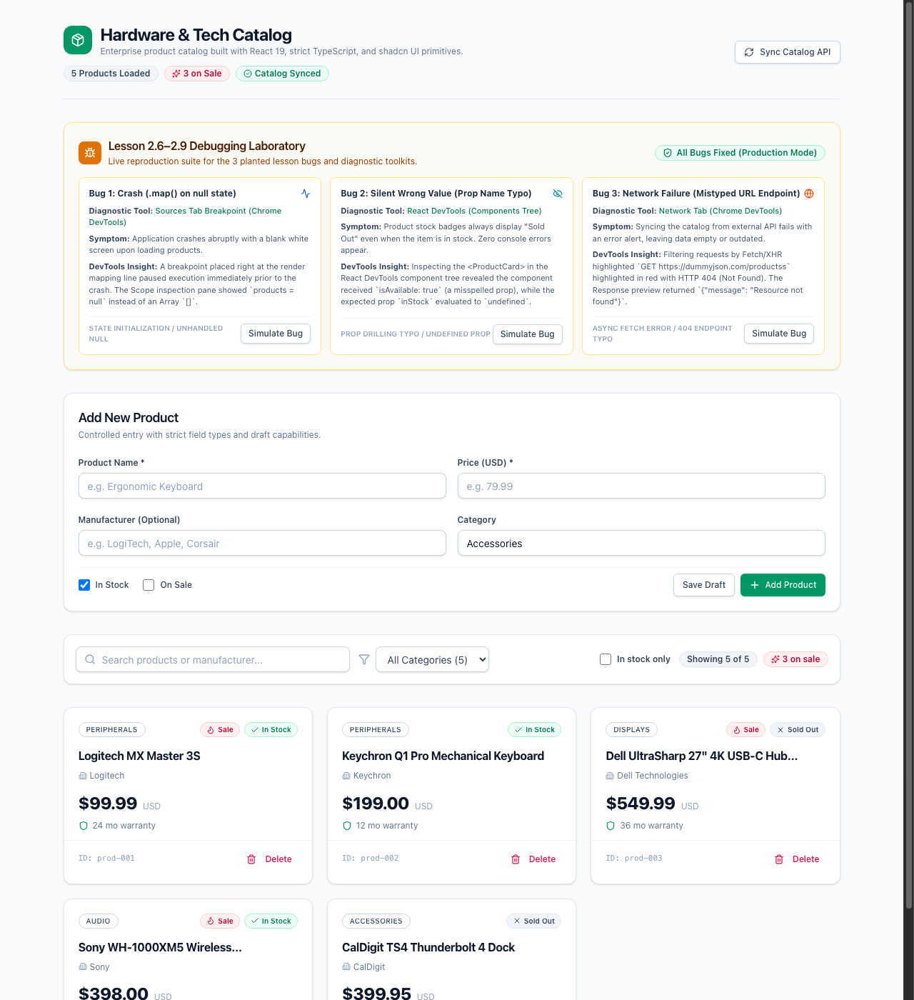
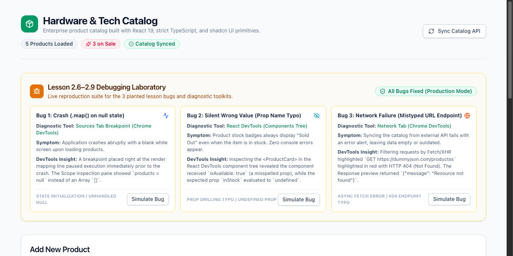
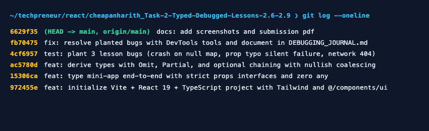
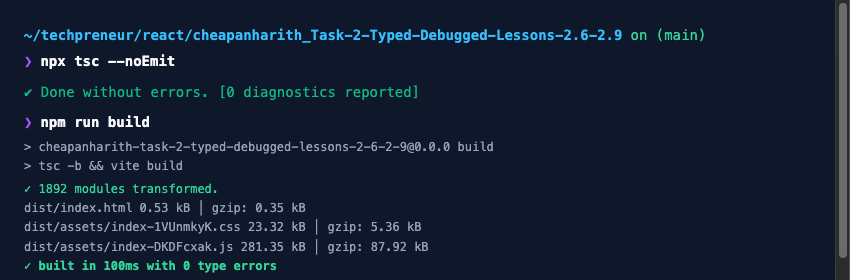

# Task 2 — Typed & Debugged (Lessons 2.6–2.9)

**Student:** Chea Panharith  
**GitHub Repository:** [https://github.com/panharithhh/cheapanharith_Task-2-Typed-Debugged-Lessons-2.6-2.9](https://github.com/panharithhh/cheapanharith_Task-2-Typed-Debugged-Lessons-2.6-2.9)  

An enterprise-ready Hardware & Tech Catalog mini-app built with React 19, strict TypeScript (zero `any`), Tailwind CSS, and shadcn-style `@/components/ui/` primitives. Features end-to-end typing, derived types (`Omit`, `Partial`), null-safe chaining (`?.`, `??`), and a full three-bug diagnostic laboratory.

---

## Deliverables

### 1. One Sentence Deliverable
> **Which tool caught which bug—and why the console alone was not enough:**  
> The Chrome Sources tab breakpoint paused runtime execution right at the render loop to reveal that the list state variable was `null` instead of an array; React DevTools inspected the live component tree hierarchy to uncover that `inStock` was `undefined` due to a silent prop name typo which produced zero runtime errors in the console; and the DevTools Network tab inspected the HTTP transaction to isolate the `404 Not Found` and server error payload caused by a mistyped URL endpoint, none of which the standard console alone could pinpoint.

---

### 2. The Debugging Journal
See [`DEBUGGING_JOURNAL.md`](./DEBUGGING_JOURNAL.md) for detailed symptom -> tool -> what it showed -> fix case studies:
- **Bug 1 (Crash):** `.map()` on null state -> Diagnosed with Chrome DevTools **Sources Breakpoint**.
- **Bug 2 (Silent Wrong Value):** Prop name typo -> Diagnosed with **React DevTools** Components tree.
- **Bug 3 (Network Failure):** Mistyped URL endpoint -> Diagnosed with **Network tab** (HTTP 404 & response payload).

---

### 3. GitHub Commits Split per Requirement
```text
c0e71b8 docs: add split commits screenshot
6629f35 docs: add screenshots and submission pdf
fb70475 fix: resolve planted bugs with DevTools tools and document in DEBUGGING_JOURNAL.md
4cf6957 test: plant 3 lesson bugs (crash on null map, prop typo silent failure, network 404)
ac5780d feat: derive types with Omit, Partial, and optional chaining with nullish coalescing
15306ca feat: type mini-app end-to-end with strict props interfaces and zero any
972455e feat: initialize Vite + React 19 + TypeScript project with Tailwind and @/components/ui
```

---

## Screenshots & Verification

### 1. Catalog Overview with Shadcn UI Primitives & Typed Badges


### 2. Lesson 2.6–2.9 Debugging Laboratory (3 Planted Bugs Suite)


### 3. Git Commits Split in Terminal


### 4. TypeScript Clean Compilation & Production Build


---

## Audit Checklist

- [x] **Strict Props Interfaces:** Every component defines an exported props interface (`ProductHeaderProps`, `ProductCardProps`, `ProductFormProps`, `FilterBarProps`, `DebuggingLabProps`, etc.).
- [x] **Typed Event Handlers:** `React.ChangeEvent<HTMLInputElement>` and `React.ChangeEvent<HTMLSelectElement>` on all change handlers.
- [x] **Typed State:** `useState<Product[]>` for the product collection.
- [x] **Zero Implicit / Explicit `any`:** Strict TypeScript mode enabled; zero `any` keywords in the codebase.
- [x] **Derived Types via Utility Types:**
  - `PublicProduct = Omit<Product, 'internalCost' | 'internalSupplierNote'>`
  - `ProductFormDraft = Partial<ProductFormData>`
- [x] **Safe Optional Access:** All optional fields accessed using optional chaining (`?.`) with nullish coalescing fallback (`??`).
- [x] **Team Rules (`AGENTS.md`):**
  - React 19 + TypeScript.
  - UI strictly from `@/components/ui/` (`Card`, `Badge`, `Button`, `Input`, `Label`).
  - Styling with Tailwind CSS utility classes + `cn()`.
  - Icons exclusively from `lucide-react`.
  - State updates strictly immutable (`prev => ...`).

---

## Local Development

```bash
# Install dependencies
npm install

# Start development server
npm run dev

# Run TypeScript check and production build
npm run build
```
